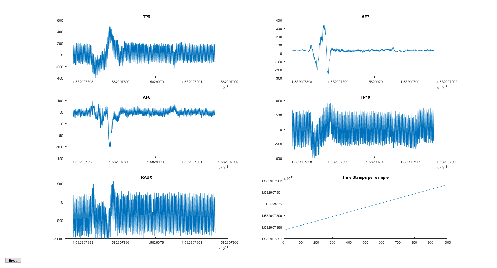

# Red Muse

A Python package for streaming (on LSL and UDP), visualizing, and recording EEG data from the Muse 2016 headband. 



## Requirements

The code relies on [pygatt](https://github.com/peplin/pygatt) or [BlueMuse](https://github.com/kowalej/BlueMuse/tree/master/Dist) for BLE communication and works differently on different operating systems.

- Windows: On Windows 10, we recommend using a BLED112 dongle and RedMuse's bgapi backend (`muselsl stream --backend bgapi`).
- Mac: On Mac, a **BLED112 dongle is required**. The bgapi backend is required and will be used by default when running RedMuse from the command line
- Linux: No dongle required. However, you may need to run a command to enable root-level access to bluetooth hardware (see [Common Issues](#linux)). The pygatt backend is required and will be used by default from the command line.

**Compatible with Python 2.7 and Python 3.x**

**Only compatible with Muse 2 and Muse 2016 (Models: MU-02 and MU-03)**

_Note: if you run into any issues, first check out out [Common Issues](#common-issues) and then the Issues section of this repository_

## Getting Started

### Installation

Install RedMuse with pip locally. 

    git clone https://github.com/bardiabarabadi/RedMuse.git
    cd RedMuse
    pip install .

### Setting Up a Stream

The easiest way to get Muse data is to use muselsl directly from the command line. Use the `-h` flag to get a comprehensive list of all commands and options. Also, use `-b bgapi` for windows

To print a list of available muses:

    $ muselsl list

To begin an LSL stream from the first available Muse:

    $ muselsl stream  

To connect to a specific Muse you can pass the name of the device as an argument. Device names can be found on the inside of the left earpiece (e.g. Muse-41D2):

    $ muselsl stream --name YOUR_DEVICE_NAME

You can also directly pass the MAC address of your Muse. This provides the benefit of bypassing the device discovery step and can make connecting to devices quicker and more reliable:

    $ muselsl stream --address YOUR_DEVICE_ADDRESS

### Sending a Stream over UDP

To stream data to a UDP socket you need to specify the address and port number. Default values are shown below. use `-b bgapi` for Windows.

To print a list of available muses:

    $ muselsl list

To begin an LSL stream from the first available Muse over UDP:

    $ muselsl udp_stream --interface localhost --port 9216
    $ muselsl upd_stream -i localhost -t 9216

To connect to a specific Muse you can pass the name of the device as an argument. Device names can be found on the inside of the left earpiece (e.g. Muse-41D2):

    $ muselsl upd_stream --name YOUR_DEVICE_NAME

You can also directly pass the MAC address of your Muse. This provides the benefit of bypassing the device discovery step and can make connecting to devices quicker and more reliable:

    $ muselsl upd_stream --address YOUR_DEVICE_ADDRESS

### Working with Streaming Data

Once an LSL stream is created, you have access to the following commands. You can also monitor the data by running **_plot_UPD.m_**. Make sure to set address and port for the UDP in the .m file.

*Note: the process running the `stream` or stream command must be kept alive in order to maintain the LSL stream. These following commands should be run in another terminal or second process. *

To view data:

    $ muselsl view

If the visualization freezes or is laggy, you can also try the alternate version 2 of the viewer. *Note: this will require the additional [vispy](https://github.com/vispy/vispy) and [mne](https://github.com/mne-tools/mne-python) dependencies*

    $ muselsl view --version 2

To record EEG data into a CSV:

    $ muselsl record --duration 60  

*Note: this command will also save data from any LSL stream containing 'Markers' data, such as from the stimulus presentation scripts in [EEG Notebooks](https://github.com/neurotechx/eeg-notebooks)*

Alternatively, you can record data directly without using LSL through the following command:

    $ muselsl record_direct --duration 60

_Note: direct recording does not allow 'Markers' data to be recorded_

## What is LSL?

Lab Streaming Layer or LSL is a system designed to unify the collection of time series data for research experiments. It has become standard in the field of EEG-based brain-computer interfaces for its ability to make seperate streams of data available on a network with time synchronization and near real-time access. For more information, check out this [lecture from Modern Brain-Computer Interface Design](https://www.youtube.com/watch?v=Y1at7yrcFW0) or the [LSL repository](https://github.com/sccn/labstreaminglayer)

## Common Issues

### Mac and Windows

1.  Connection issues with BLED112 dongle:

- You may need to use the `--interface` argument to provide the appropriate COM port value for the BLED112 device. The default value is COM9. To setup or view the device's COM port go to your OS's system settings

### Linux

1.  `pygatt.exceptions.BLEError: Unexpected error when scanning: Set scan parameters failed: Operation not permitted` (Linux)

- This is an issue with pygatt requiring root privileges to run a scan. Make sure you [have `libcap` installed](https://askubuntu.com/questions/347788/how-can-i-install-libpcap-header-files-on-ubuntu-12-04) and run `` sudo setcap 'cap_net_raw,cap_net_admin+eip' `which hcitool` ``

2.  `pygatt.exceptions.BLEError: No characteristic found matching 273e0003-4c4d-454d-96be-f03bac821358` (Linux)

- There is a problem with the most recent version of pygatt. Work around this by downgrading to 3.1.1: `pip install pygatt==3.1.1`

3.  `pygatt.exceptions.BLEError: No BLE adapter found` (Linux)

- Make sure your computer's Bluetooth is turned on.

4.  `pygatt.exceptions.BLEError: Unexpected error when scanning: Set scan parameters failed: Connection timed out` (Linux)

- This seems to be due to a OS-level Bluetooth crash. Try turning your computer's bluetooth off and on again

5.  `'RuntimeError: could not create stream outlet'` (Linux)

- This appears to be due to Linux-specific issues with the newest version of pylsl. Ensure that you have pylsl 1.10.5 installed in the environment in which you are trying to run RedMuse

## Citing red-muse

```
@misc{red-muse,
  author       = {Bardia Barabadi},
  title        = {red-muse},
  month        = feburary,
  year         = 2020,
  doi          = {},
  url          = {}
}
```